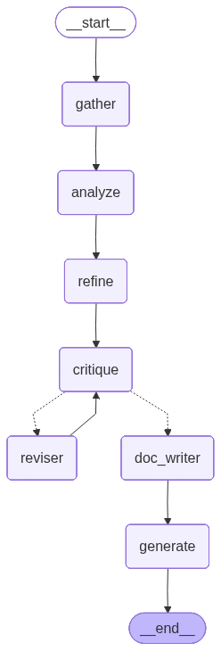

# Repocaster: Automated MCP Server Generator for Computational Biology

**Repocaster** is an intelligent agentic framework designed to automatically "cast" existing GitHub repositories or local codebases into **Model Context Protocol (MCP)** servers.

While Repocaster is a general-purpose tool, it has been specifically optimized for **Computational Biology** workflows. It enables researchers and developers to instantly transform complex, CLI-based bio-informatics tools (such as ProteinMPNN, ESM, or docking utilities) into interactive, AI-accessible tools without writing a single line of wrapper code.

## 🧠 How It Works

Repocaster employs a multi-stage agentic pipeline powered by **LangGraph**:

1.  **Repository Ingestion**: Clones the target repository (remote GitHub URL or local path).
2.  **AST Analysis**: Uses Python's Abstract Syntax Tree (AST) to statically analyze the codebase. It identifies entry points, argument parsers, and function signatures.
3.  **Deep Agent Reasoning**: A multi-step LLM agent analyzes the code structure and usage examples to understand the *intent* and "Golden Workflows" of the tool.
    *   **Workflow Analyst**: Identifies the correct execution order of scripts (e.g., pre-processing -> inference).
    *   **Schema Refiner**: Selects critical arguments and filters out noise.
    *   **Tool Critic & Reviser**: Iteratively improves tool coverage and argument completeness while avoiding redundancy.
4.  **MCP Server Generation**: The agent generates a fully functional `server.py` using the `fastmcp` library, exposing the repository's capabilities as structured tools.

### 📊 LangGraph Visualization

LangGraph orchestrates the agent process. Below is the visualization of the agentic workflow:



## 🚀 Installation

```bash
# Clone the repository
git clone https://github.com/ivandon15/repocaster.git
cd repocaster

# Install dependencies
pip install -r requirements.txt
```

## 💻 Usage

Run `cast.py` with the target repository URL.

### Basic Usage (OpenAI)

Ensure you have `OPENAI_API_KEY` set in your environment.

```bash
export OPENAI_API_KEY=sk-...
python cast.py https://github.com/dauparas/ProteinMPNN
```

### Using Other Models (e.g., DeepSeek, Qwen)

You can specify a custom model name, base URL, and the *name* of the environment variable containing your API key.

```bash
# Example: Using DeepSeek
export DEEPSEEK_API_KEY=sk-...
python cast.py https://github.com/dauparas/ProteinMPNN \
  --model_name deepseek-chat \
  --model_url https://api.deepseek.com \
  --api_key DEEPSEEK_API_KEY
```

```bash
# Example: Using Qwen (via DashScope)
export QWEN_API_KEY=sk-...
python cast.py https://github.com/facebookresearch/esm \
  --model_name qwen3-max \
  --model_url https://dashscope.aliyuncs.com/compatible-mode/v1 \
  --api_key QWEN_API_KEY
```

The generated MCP server will be saved in:
`./mcp_servers/<RepoName>/`

You can then run the generated server using the MCP inspector or configure it in your MCP client (But you'd better refine the server code a bit first):

```bash
mcp dev mcp_servers/ProteinMPNN/server.py
```

## 🧪 Case Study: ProteinMPNN

We have successfully applied Repocaster to **ProteinMPNN**, a state-of-the-art protein sequence design method.

Repocaster automatically:
1.  Identified `protein_mpnn_run.py` as the main inference script.
2.  Detected helper scripts like `parse_multiple_chains.py` for data preprocessing.
3.  Generated an MCP server exposing these as tools:
    *   `parse_chains`: Converts PDB files to the required JSONL format.
    *   `protein_mpnn_run`: Runs the sequence design model with parameters like `sampling_temp`, `num_seq_per_target`, etc.

More details and examples can be found in the `mcp_servers/ProteinMPNN/` directory.

## 📜 License
This project is licensed under the MIT License. See the [LICENSE](./LICENSE) file for details.
